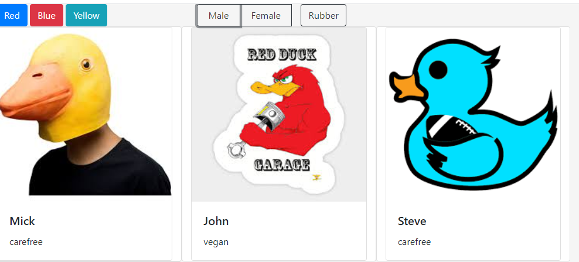

#bootstraps
## Description -- 
This project is an exploration into the bootstrap grid system.  We used bootstrap cards to display a collection of ducks.(both real and rubber).  We also give our users the ability to filter the ducks, by color, gender, and if the ducks are rubber.

## Screen shots

## Instructions how to run
1.  Clone down the repo.
2. Make sure you have http - server installed via npm.  If not, get it [here](https://www.npmjs.com/package/http-server)
3. On your command line run `hs -p 9999`.
4.  Navigate to local host `http://localhost:9999`

 ### h3
 [Google](www.google.com)
 * thing 1
 * thing 2
 1. first
 2. second
